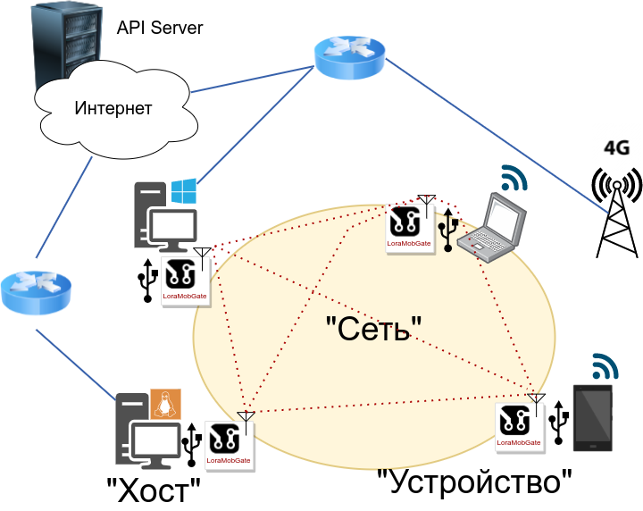
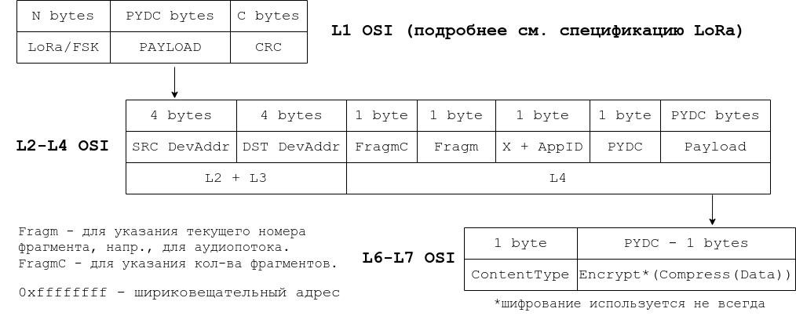

# LoRaMobGate Project

Проект предназначен для обеспечения коммуникации пользователей на большом расстоянии путём подключения с помощью USB к смартфону/ноутбуку/компьютеру ("Хост") специального Устройства, оснащённого радиомодулем LoRa. В совокупности с Хостом оно одновременно является одноканальным LoRa-шлюзом для конечных устройств Интернета Вещей (IoT). 

В описании проекта главным звеном является Устройство, а Хост рассматривается как обычная вычислительная мощность к нему в придачц, поэтому далее в повествовании под Устройством будет подразумеваться связка этих двух компонентов.


Архитектура системы включает в себя:
- Устройство (**Device**). Состоит из микроконтроллера (МК), радиомодуля и обвязки для V-USB.
- Хост (**Host**). Любая ЭВМ, оснащённая USB-портом в режиме host-mode. Практически любой современный смартфон удовлетворяет этому требованию.
- Сеть (**Network**). Образуется Устройствами при помощи ПО на Хосте. Данное ПО включает в себя облегчённый стек сетевых протолов, который отчасти копирует TCP/IP и приспособлен для потребностей проекта.
- API-сервер. Выполняет вспомогательную функции: маршрутизация пакетов Сети через сеть Интернет, когда она доступна, связывание сегментов Сети, находящихся на расстояних, на которых связь через радиоканал невозможна.


Возможности:
- Децентрализованная коммуникационная сеть большого радиуса действия.
- Собственный облегчённый стек протоколов.
- Приложение для всех популярных операционных систем (на текущий момент есть сценарий сборки исполняемого файла только под ОС Android), представляющее собой мессенджер. Помимо явных функций мессенджера, имеет ПО для обеспечения работы LoRa-шлюза.
- Дешёвое в плане элементной базы устройство на китайском модуле Ra-01SC/Ra-02 и МК Atmega168PA.

### Устройство (**Device**)
Устройство построено на базе МК Atmega168PA и радмомодуля Ra-01SC/Ra-02. Для связи с Хостом используется реализация [V-USB](https://www.obdev.at/products/vusb/index.html) с тактовой частотой 16 МГц. Для взаимодействия с модулем задействован интерефейс SPI и библиотека [LoRaRF](https://github.com/chandrawi/LoRaRF-Arduino). Для согласования уровней (радиомодуль работает от 3.3В) вся схема питается от 3.55-3.7В, получаемых от USB-порта через два последовательно включённых светодиода. Несмотря на то, что согласно документации для работы МК на частотах от 10-20МГц требуется напряжение питания 4.5-5.5В, экспериментально установлено, что устройство функционирует корректно и от такого пониженного напряжения. Прерывание с наивысшим приоритетом `INT0` используется для работы с V-USB, а `INT1` - для обратного вызова с модуля при приёме сообщения из эфира.


Устройство имеет перечень реализованных команд, всего `63` команды: `51` к радиомодулю, `12` - к МК. Забегая наперёд уточню, что для команды кодируются одним байтом и команды к радиомодулю занимают диапазон 100-200, а команды к МК - диапазон 200-255.

В EEPROM память МК записываются следующие данные:
| Название | Предназначение |
| ------ | ------ |
| [devAddr](https://github.com/comradeFreeman/loramobgate/blob/ce9ea6843d09e33fa841d488b3c35dac4adfd7fa/device/src/eeprom_vars.h#L2) | Уникальный сетевой адрес Устройства |
| [loraSyncWord](https://github.com/comradeFreeman/loramobgate/blob/ce9ea6843d09e33fa841d488b3c35dac4adfd7fa/device/src/eeprom_vars.h#L3) | Фраза синхронизации для взаимодействия на L1 LoRa |
| [country](https://github.com/comradeFreeman/loramobgate/blob/ce9ea6843d09e33fa841d488b3c35dac4adfd7fa/device/src/eeprom_vars.h#L4) | Код страны по ISO3166-1. Введён на случай наличия ограничений по выходной мощности передатчика в конкретной стране (в коде пока не имплементировано).  |
| [privateKey](https://github.com/comradeFreeman/loramobgate/blob/ce9ea6843d09e33fa841d488b3c35dac4adfd7fa/device/src/eeprom_vars.h#L16) | Закрытый ключ Устройства, применяется для шифрования в мессенджере (более подробно - дальше). |

Обмен с Хостом осуществляется с помощью определённого формата пакета, приведённого ниже. 
   а) Host -> Device
| 1 byte | 1 byte | 1 byte    | 2 bytes | ARG1LEN bytes     | ... |  ARGnLEN bytes | PYDC bytes    |
| ---      | ---       | ---      | ---       | ---      | ---       | --- | ---      |
| OPCODE | ARGC | PYDST | PYDC | ARG1 | ... | ARGn | PAYLOAD |
| Код операции | Кол-во аргументов | Индекс начала полезной нагрузки | Длина полезной нагрузки | Аргумент 1 | ... | Аргумент n | Полезная нагрузка
+ Начало PAYLOAD надо размещать на байтах, кратных 8, для упрощения чтения через V-USB
   
б) Device -> Host
| 1 byte |   2 bytes  |  PYDC bytes  |
| ---    | ---        | ---          |
| OPCODE |    PYDC    |   PAYLOAD    |     

### Сеть и ПО Хоста
Обмен между Устройствами осуществляется с помощью разработанного облегчённого стека протоколов, функционально частично повторяющего стек TCP/IP.

Работа Сети и взаимодействие с Устройством реализованы программно в [коде](https://github.com/comradeFreeman/loramobgate/tree/master/messenger/device) и разбиты на классы, каждый из которых выполняет свою определённую роль, схематически их связь можно представить следующим образом:


- `UsbConnection`. Предназначен для поиска устройства на шине, установки и поддержания соединения с ним и обмен данными в обе стороны.
- `Keys`. Этот класс отвечает за все, что связано с ключами, шифрованием, дешифрованием и т.д. Как уже упоминалось ранее, шифрование используется только в мессенджере, для этого используется криптография на эллиптических кривых для генерации пар «закрытый ключ-публичный ключ», протокол ECDH для согласования ключей и генерации ключа чата и алгоритм Salsa20 для собственно шифрования данных. Класс отвечает за хранение закрытого ключа устройства, публичных ключей других устройств, генерацию ключа чата.
- `Network`. Отвечает за события сети (как ни странно), обмен ключами и построение дерева соседей. К событиям сети относятся следующие события:
    + Информация о соседях (`L3NEIGHBORINFO`). Раз в некоторый промежуток времени Устройство рассылает широковещательный пакет, в который помещает свою таблицу соседей. Все, кто примут этот пакет, обновляют свое дерево соседей. Таким образом на каждом Устройстве через некоторое время формируется дерево соседей на некоторое количество прыжков. В коде дерево реализовано с использованием модуля `anytree`. (**на текущений момент на начальной стадии**)
    + Запрос публичного ключа (`L3KEYRQ`). Выше (в классе `Keys`) было сказано, что для генерации ключа чата используется ECDH, который требует, чтобы у каждого из двух абонентов был публичных ключ другой стороны. А что делать, если у кого-то его нет? Тогда класс Keys при попытке шифрования и не нахождении нужного публичного ключа автоматически формирует широковещательный сетевой пакет с запросом о публичном ключе, связанном с Устройством назначения, которое впоследствии отправляется в эфир Устройством. Первое же Устройство, которое найдет в своей базе ключей нужное, присылает его к отправителю (тоже широковещательный пакет) в пакете типа L3KEYEX. Таким образом другие Устройства в сети тоже узнают этот ключ и аналогичных запросов станет меньше.
    + Обмен публичными ключами (L3KEYEX). При приеме пакета с одноимённым типом запроса, все Устройства обновляют свою базы ключей, добавляя новую пару «устройство - публичный ключ», и пересылают пакет дальше.
- `InternetConnection`. Отвечает за соединение с сетью Интернет и через него проходят запросы в API на сервере, также не будем заострять на нем внимание.
- `UsbPacket` и `NetPacket` реализуют в коде форматы, упоминавшиеся выше. Среди полей последнего следуют выделить `AppID` и `ContentType`, являющиеся перечислениями. Можно принять, что последний является подтипом в пределах первого типа данных.
    | Перечисление `AppID` | Значение | 
    | -- | -- |
    |`UNKNOWN`|0|
    |`MESSENGER`|1|
    |`NETWORK`|2|
    |`LORA`|3|
    |`INVALID`|15|

    | Перечисление `ContentType` | Значение | 
    | -- | -- |
    | `UNKNOWN`|0|
    |`TEXT`|10|
    |`VOICE`|11|
    |`IMAGE`|12|
    |`AUDIO`|13|
    |`MESSAGE_STATUS`|14|
    |`MESSAGE_OPTIONS`|15|
    |`EMERGENCY`|19|
    |`L3NEIGHBORINFO`|20|
    |`L3KEYEX`|21|
    |`L3KEYRQ`|22| 
    |`L3CNFRP`|23|
    |`LORA`|30|
    |`INVALID`|255|

- `Device`. Класс является агрегирующим классом, объединяющим все вышеупомянутые классы и содержащим в себе почти всю логику работы устройства - от инициализации по USB до очереди расшифрованных сообщений мессенджера, плюс методы для еще большего уровня абстракции.

### API-сервер
Для разгрузки радиоканала, когда у устройств есть доступ к Интернету, и возможности объединять отдельные сегменты Сети на языке `Python` был написан [API-сервер](https://github.com/comradeFreeman/loramobgate/tree/master/server), для этого была использована библиотека `fastapi`. Большинство конечных точек требуют авторизации по токену. API-сервер не хранит принятых данных, а только их ретранслирует, и поэтому для их хранения используется БД `Redis` и ORM библиотека `redis-om`. Почти все конечные точки требуют авторизации по токену для работы, ккоторый можно получить, обратившись к конечной точке `/token`, отправив на неё `POST`-запросом форму, "пользователь - пароль", где "пользователь" - сетевой адрес устройства, а "пароль" - закрытый ключ, вычитываемый из `EEPROM` Устройства. Эти данные будут сверены API-сервером со своей БД, которая содержит полный список сетевых адресов и хешей закрытых ключей всех когда-либо выпущенных Устройств.
| Тип запроса | Конечная точка | Назначение |
| -- | -- | -- |
| _POST_ | /token | Получение токена |
| _GET_  | /users/me | Информация о текущем Устройстве|
| _GET_  | /device/packets | Получить входящие пакеты |
| _POST_ | /device/packets | Отправить пакеты на сервер|
| _GET_  | /device/packets/count | Количество входящих пакетов |
| _POST_ | /network/neighbors  | Отправить информацию о соседях на сервер |
| _GET_  | /network/stats | Общая статистика Сети |

Также API-сервер может принимать от устройств информацию о соседях и строить дерево связей (**на текущий момент не реализовано!**), чтобы осуществлять так называемую «умную» маршрутизацию пакетов - то есть передавать пакет через посредников и желательно через сеть Интернет, пример показан выше. Пусть `А` хочет прислать пакет Устройства `В`, но оно далеко. Тогда он поочередно присылает его в эфир и на API-сервер. API-сервер знает топологию сегмента Сети и при следующем опросе Устройством `Б` конечной точки `/device/packets/` в ответ добавит также и пакет от Устройства `А` до `В`, который будет ретранслирован через радиоканал.


### LoRa-шлюз
Шлюз **будет** реализован программно. Суть его работы будет заключаться в следующем. Если Устройство получает некий пакет из эфира и в ходе проверки оказывается, что это пакет от конечного устройства LoRa (`AppID.LoRa`), то такой пакет отправляется API-серверу, если к нему есть доступ, иначе отравляется другим Устройствам по радиоканалу. API-сервер обращается к API TheThingsNetwork и пересылает пакет ему. Каждое устройство при первом обращении к API-серверу запускает на последнем процедуру регистрации Устройства как Шлюза.

### Приложение-мессенджер

# Использование

> На текущий момент при сборке прошивки Устройства с помощью [Arduino-Makefile](https://github.com/sudar/Arduino-Makefile) по непонятной причине на полученной прошивке не будет работать приём. Рекомендуется собирать код при помощи Arduino IDE. Также на данный момент в `Makefile` не работает прошивка Устройства через USBASP.

ПО Устройства можно собрать при помощи [Arduino-Makefile](https://github.com/sudar/Arduino-Makefile), выполнив в [директории](https://github.com/comradeFreeman/loramobgate/tree/master/device/src) исходного кода команду `make`. 
> Для этого у Вас должны быть установлены `Arduino IDE` и `avrdude`

[ПО Хоста](https://github.com/comradeFreeman/loramobgate/tree/master/messenger/device) можно использовать отдельно от приложения, оно является лишь одним из возможных фронтендов.
```sh
git clone https://github.com/comradeFreeman/loramobgate.git
cd loramobgate/messenger
python3 -m venv venv
source venv/bin/activate
# Чтобы использовать только ПО Хоста:
pip install <перечень зависимостей для ПО Хоста>
# Если планируется использовать ещё и мессенджер:
pip install Cython <выверить последовательность>
pip install -r packages
```
Запуск только ПО Хоста:
```sh
python3

Python 3.10.6 (main, Mar 10 2023, 10:55:28) [GCC 11.3.0] on linux
Type "help", "copyright", "credits" or "license" for more information.
>>> 
<Написать>

```
Запуск мессенджера:
```sh
python main.py
```
